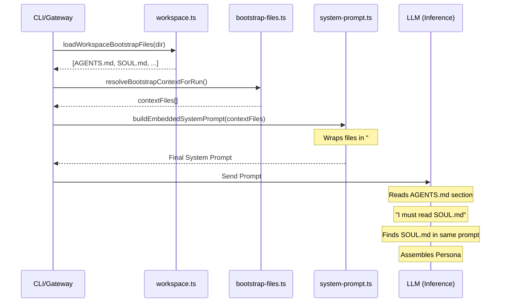

# AGENTS.md Meta-Prompt Logic

This document explores how `AGENTS.md` functions as a meta-prompt in OpenClaw, guiding both main agents and sub-agents on how to assemble their operational context.

## Overview

In OpenClaw, `AGENTS.md` is treated as a "bootstrap file" that provides foundational instructions for the LLM. It acts as a meta-prompt because it doesn't just provide content—it provides *directions* on which other files the agent should prioritize and how it should handle memory and tools.

## The Assembly Pipeline

The "execution" of the `AGENTS.md` logic happens across several layers of the codebase:

### 1. File Discovery & Loading
- **Location**: workspace.ts
- **Logic**: The `loadWorkspaceBootstrapFiles` function reads a set of predefined files from the workspace directory, including `AGENTS.md`, `SOUL.md`, `USER.md`, and `TOOLS.md`.

### 2. Context Filtering (Sub-agent Logic)
- **Location**: workspace.ts
- **Logic**: For sub-agent sessions, `filterBootstrapFilesForSession` limits the available files to just `AGENTS.md` and `TOOLS.md`. This ensures sub-agents share the workspace rules and tool knowledge but do not inherit the main agent's complex persona (`SOUL.md`).

### 3. Prompt Injection
- **Location**: system-prompt.ts
- **Logic**: The `buildEmbeddedSystemPrompt` function takes these loaded files and injects them into the `## Project Context` section of the system prompt.

### 4. LLM "Execution"
- **Location**: The LLM Inference step.
- **Logic**: When the LLM receives the system prompt, it reads instructions in the `AGENTS.md` section (e.g., "Read `SOUL.md` — this is who you are").
- **Resolution**: Since the code (in step 3) already injected `SOUL.md` into the same prompt, the LLM immediately "finds" the information it was instructed to look for, effectively "assembling" its persona.

## Sequence Diagram

## Significance of the Meta-Prompt
By using `AGENTS.md` as an instruction layer *inside* the prompt, OpenClaw allows technical requirements (like reading specific files or following memory rules) to be communicated to the AI in a language it understands, rather than relying solely on hardcoded logic in the runner.
