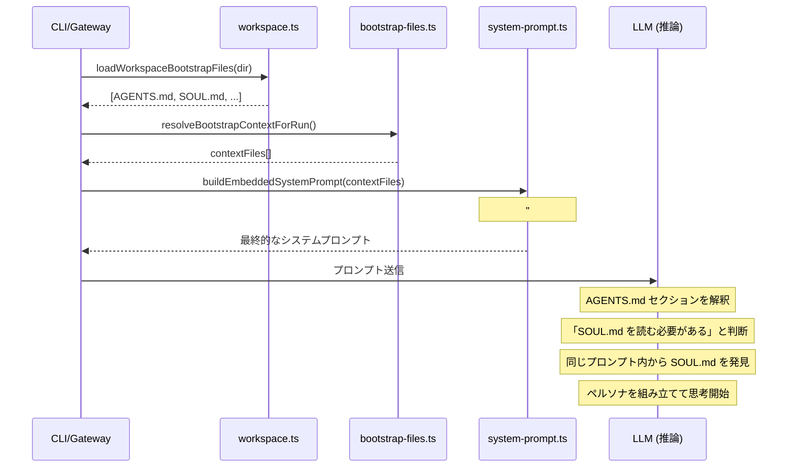

# AGENTS.md メタプロンプト・ロジック

このドキュメントでは、OpenClawにおいて `AGENTS.md` がどのように「メタプロンプト」として機能し、メインエージェントやサブエージェントがどのように実行コンテキストを組み立てるかを説明します。

## 概要

OpenClawにおける `AGENTS.md` は、LLMに対する基礎的な指示を提供する「ブートストラップ・ファイル」として扱われます。これがメタプロンプトと呼ばれる理由は、単なるコンテンツを提供するだけでなく、「エージェントがどのファイルを優先すべきか」「メモリやツールをどう扱うべきか」という**動作の指針（メタ的な指示）**を含んでいるためです。

## アセンブリ・パイプライン

`AGENTS.md` のロジックが実際に「実行」され、組み立てられるプロセスは、コードベースの複数のレイヤーにわたっています。

### 1. ファイルの探索と読み込み
- **場所**: workspace.ts
- **ロジック**: `loadWorkspaceBootstrapFiles` 関数が、ワークスペースディレクトリから `AGENTS.md`, `SOUL.md`, `USER.md`, `TOOLS.md` などの定義済みファイルを読み込みます。

### 2. コンテキストのフィルタリング（サブエージェント専用ロジック）
- **場所**: workspace.ts
- **ロジック**: サブエージェントのセッションでは、`filterBootstrapFilesForSession` によって利用可能なファイルが `AGENTS.md` と `TOOLS.md` だけに制限されます。これにより、サブエージェントはワークスペースの共有ルールやツール知識は継承しますが、メインエージェントの複雑な人格（`SOUL.md`）は継承せず、タスクに集中できるようになっています。

### 3. プロンプトへの注入
- **場所**: system-prompt.ts
- **ロジック**: `buildEmbeddedSystemPrompt` 関数が、読み込まれたファイルをシステムプロンプトの `## Project Context` セクションに注入します。

### 4. LLMによる「実行」
- **場所**: LLM 推論ステップ
- **ロジック**: LLM はシステムプロンプトを受け取ると、`AGENTS.md` セクションにある指示（例：「`SOUL.md` を読み、自分が誰であるか理解せよ」）を読み取ります。
- **解決**: ステップ 3 のコードによって、すでに `SOUL.md` の内容は同じプロンプト内に注入されているため、LLM は即座に指示された情報を見つけ出し、自分の人格（ペルソナ）を「組み立てる」ことができます。

## シーケンス図

## メタプロンプトとしての意義
`AGENTS.md` をプロンプト内の「指示レイヤー」として使用することで、OpenClaw は特定のファイルを読み込む、メモリのルールに従うといった技術的な要件を、コードによるハードコードではなく、AI が理解できる自然言語の形で伝えることができます。
